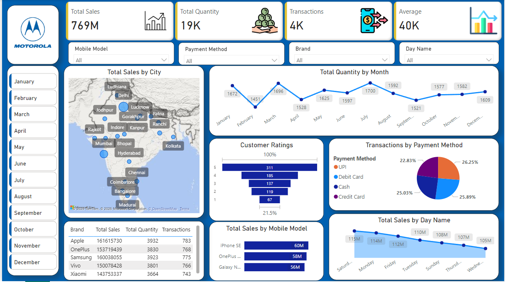

# Mobile Sales Dashboard

## Project Overview

This project presents an interactive Mobile Sales Dashboard developed in Power BI to analyze sales performance, customer transactions, payment methods, and brand-wise trends. The dashboard provides insights into customer purchasing behavior and helps monitor key sales metrics across different regions and time periods.

## Dashboard Preview

## Key Metrics

* Total Sales: 769M
* Total Quantity Sold: 19K
* Total Transactions: 4K
* Average Sales Value: 40K

## Features

* City-wise Sales Analysis
* Monthly Quantity Trend Analysis
* Customer Rating Analysis
* Payment Method Distribution
* Brand-wise Performance Tracking
* Mobile Model Sales Analysis
* Day-wise Sales Trend Analysis
* Interactive Filters and Slicers

## Tools Used

* Power BI
* Power Query
* DAX
* Excel

## Key Insights

* Sales are distributed across major cities in India.
* UPI, Debit Card, Cash, and Credit Card contribute almost equally to transactions.
* Customer ratings are predominantly positive.
* Certain mobile models contribute significantly more sales than others.
* Sales performance varies across days of the week and months of the year.

## Files Included

* Mobile Sales Dashboard.pbix
* Mobile Sales Data.xlsx
* Screenshot_20250131_231214.png
* README.md

